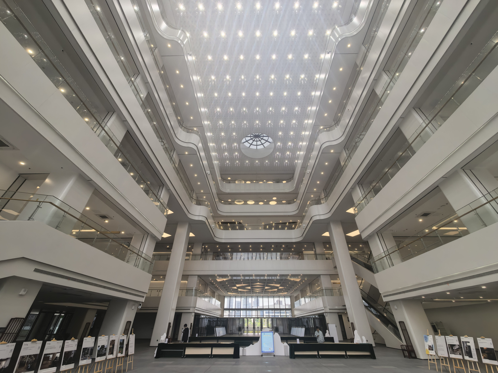
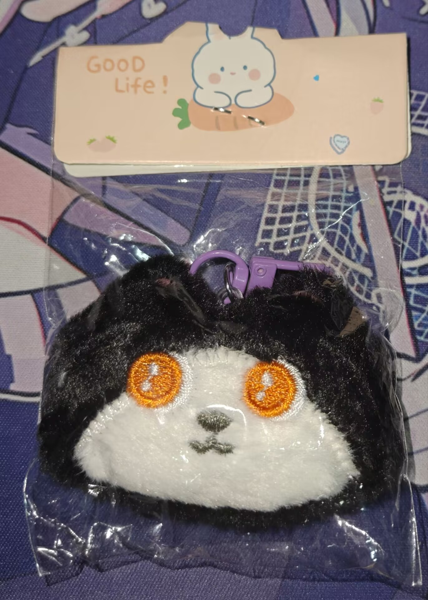
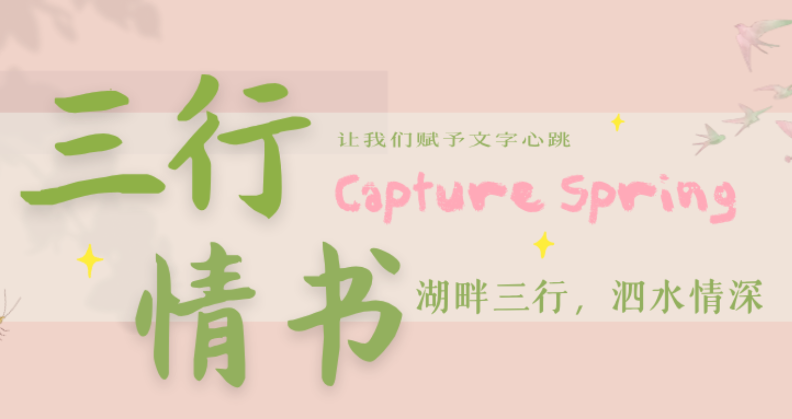
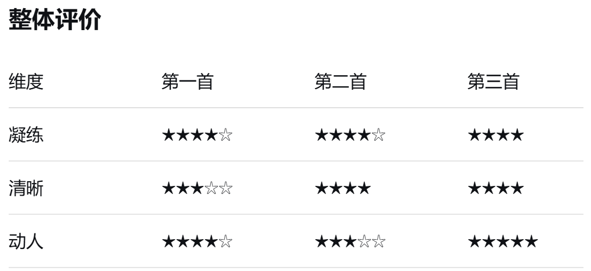

## 简介
本文用于记述笔者参与校读书节活动的经历以及个人关于此次活动和创作的感想。

## 活动体验
4月23日的上午，提前完成电路仿真实验课任务的我冒着小雨走在前往牧星楼的路上。时间尚早，走到南山苑广场前时，活动摊位的人并不多，我拿出手机，发现还有接近半小时的余裕，"那就趁早去看看吧！(｡•o•｡∩)"

第一个活动便是在明信片上写推书。我选择了丹尼尔•凯斯的《献给阿尔吉侬的花束》，从各种意义上，这都是对我影响很大的一本书，不仅仅是因为我高中时在校公众号上投稿过它的推文、在杨老师开展的课前演讲介绍过它、在孙老师开展的读书报告会上用过它的素材......更多的也许是对查理和阿尔吉侬间羁绊和命运的伤感，以及至今印象深刻的那句话：
:::quote

"智慧是人类最伟大的恩赐之一，只是在追寻知识的过程中，对爱的追寻往往就被搁置一旁。"

 <right>——《献给阿尔吉侬的花束》</right>
:::

接着便是有趣的猜谜环节。首先是根据基本信息猜书名，我一共猜了三本，分别是《人类群星闪耀时》《安娜•卡列宁娜》和《雷雨》，算是小菜一碟。不过接下来的猜诗文作者倒没有这么顺利，第一次选到了一首完全没见过的现代诗，大脑宕机的我只好换了一签，所幸这次选到了《静夜思》直接无痛通关。

然后是现场在公众号推荐适合图书馆的Bgm，"展现歌品的时候到了!（悦）",我挑了两首纯音乐，一首是轻快活泼的《The Thriller》，另一首是平静而忧伤的《裸体舞曲》。发完后我看了看评论区的其他推荐，还有《Summer》《三叶的主题音乐》等等，让我直呼："有品！"

最后参加的是时间胶囊活动，只需在明信片上写下给一年后自己的话，留下邮箱，一年后就能收到电子邮件，明信片也会在来年的活动上展出。具体的内容我现在还记得大部分，不过估计很快也会忘掉的吧......总之，希望未来的回音能给我一份惊喜！

中午上过线代课吃过饭后，我便前往问天图书馆参加套圈活动，意料之中的参与奖（恼），不过拿到手一个小挂件，倒也不错，连同上午的活动赠品算是满载而归了。

## 三行诗

（[链接](https://mp.weixin.qq.com/s/kPOk-HRPdtCpMw7e19Secw "湖畔三行，泗水情深|这个春天，让我们赋予文字心跳")！）
一开始看到投票制的时候，我其实没什么参加的欲望，毕竟如果不加宣传，恐怕我的作品都没几个人能看到（叹），但奈何还是想为自己的存在留下点痕迹，"或许就和写个签一样吧。"抱着这样的想法写了几首:
:::quote

"用指尖描摹你的轮廓，将世界染上色彩。

手心残留的温热，追不上你消散的背影。

把未诉之语咽入心中——为你，连缀起这首叹息"

 <right>——《描绘》</right>
:::
:::quote

"波浪的喧嚣在指间碎裂，

心跳与潮声重叠——海在唤我前往，

此刻，我即那不为风暴摧折的花。"

 <right>——《不折之花》</right>
:::
:::quote

"你在记忆深处藏好

我在梦境的缝隙中寻找

睁开的眼睛只想再次闭上"

 <right>——《梦中的捉迷藏》</right>
:::
不得不说，想要在三行间做好凝练、清晰和动人的平衡绝非易事，每一首都或多或少都做了取舍：第一首的感性偏重，第二首未免显得空泛，不过第三首我倒挺满意的（Deepseek给出的评价是最佳，不过我更想听听读者的想法！）。

（拓展内容：
普希金《风暴》

vietra《dream》

泰戈尔《飞鸟集》8th:

"Her wistful face haunts my dreams like the rain at night."）

"只能抒写想象与感受的诗算不算是好诗呢？"创作的过程中我想过这个问题。怎么说呢......虽然抒写的确是自己的所思所感，但是总感觉会写的缥缈，以前的我并不会感觉日常生活多么有趣，也没什么创作的才能，书写时只能抓住对某些事的追忆来倾吐我的言语，最后倒是局限于自己的情感了......或许在这点上我只能试图和我喜爱的一部分作家——那些用自己的语言构建起整个世界的伟大人物——产生一丝心灵的共鸣吧。"以我手写我心"，或许就是现在的我能所做的吧！

## 后记
这篇blog就到此结束了，忙里偷闲写下了这些东西，希望我能这样一直的记录下去！

（虽然这周的我还要处理作业和应对大物期中（ﾉ´д｀）......）
